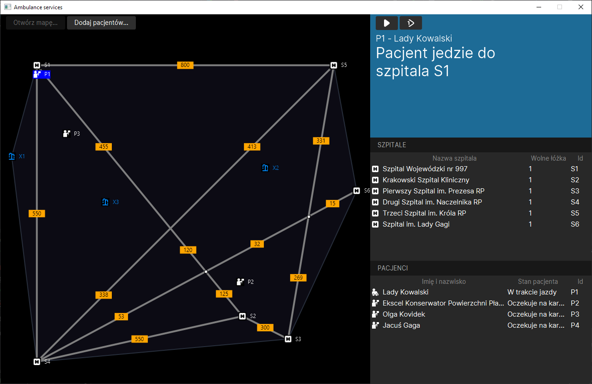

# AmbulanceServices

An ambulance dispatching simulation, automatically redirecting patients to closest hospitals with vacant beds. Powered by graph traversal, convex hull, and line intersection operations.

Created by [Kacper Achramowicz](https://github.com/Achreko), [Aleksandra Kowalczyk](https://github.com/Olakow), and [Kacper Seredyn](https://github.com/scidsgn).

